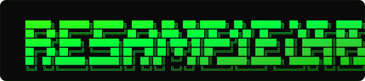

<p align="center">
  
</p>

<p align="center">
  <a href="https://resample-lab.pages.dev"></a>
  <a href="https://resample-lab.pages.dev/docs"></a>
  <a href="LICENSE"></a>
</p>

<p align="center">
  
  
  
  
  
  
  
  
  
</p>

<br />

<p align="center">
  <em><b>Upload audio. Pick a preset. Dial in the chaos. Download your sample pack.</b></em>
</p>

<p align="center">
  <em>Stretched ambiences · Ghost reverses · Granular shards · Bitrot degradation · Pitch wreckage · Loop extraction · Impact risers · Chaos pack</em>
</p>

<br />

---

<p align="center">
  <video src="docs/assets/demo.webm" controls width="100%"></video>
</p>

---

## ⚡ Quickstart

```bash
git clone https://github.com/achuthanmukundan00/Resample-Lab.git
cd Resample-Lab/apps/web
pnpm install
pnpm dev
```

Open [http://localhost:3000](http://localhost:3000). No backend. No API keys. No database.

### ☁️ One-command deploy

```bash
pnpm build
npx wrangler pages deploy out --branch main
```

> <sub>Or connect to Cloudflare Pages → build: `cd apps/web && pnpm install && pnpm build`, output: `apps/web/out`</sub>

---

## 🧬 How it works

```
┌──────────┐    ┌──────────┐    ┌──────────────┐    ┌───────────┐
│  Upload  │ -> │  Preset  │ -> │  Web Worker  │ -> │ Download  │
│  audio   │    │  select  │    │  DSP engine  │    │  ZIP pack │
└──────────┘    └──────────┘    └──────────────┘    └───────────┘
                      ↑
               ┌──────┴──────┐
               │ Chaos knob  │
               │ 0.0 → 1.0  │
               └─────────────┘
```

> *Everything runs in-browser via Web Workers. Float32Array math. No uploads. No API calls. No GPU needed.*

---

## 🎛️ Features

|     |     |
| --- | --- |
| 🎹 **8 DSP presets** | Ambient pads, ghost reverses, granular shards, bitrot, pitch wreckage, loop extraction, impact risers, chaos pack |
| 🌪️ **Chaos parameter** | Single knob: *Clean → Weird → Broken → Illegal Texture* |
| 🔒 **Fully local** | Web Workers process audio in-browser. Works offline after first load |
| 💀 **Zero AI** | All DSP is deterministic signal processing. No black boxes, no hallucinations |
| ⚡ **Static deployment** | One `pnpm build` → static export that deploys anywhere |

---

## 🎚️ Chaos Parameter

| Value | Label | Behavior |
| :---: | :--- | :--- |
| 0.00 | *Clean* | Subtle — 8× stretch, light reverb, minimal drive |
| 0.33 | *Weird* | Moderate — 12× stretch, noticeable artifacts, medium saturation |
| 0.66 | *Broken* | Aggressive — 16× stretch, heavy degradation, wide modulation |
| 1.00 | **Illegal Texture** | Maximum — 20× stretch, full reverb, extreme bitcrush, unstable LFO |

---

## 🧪 DSP Techniques

<sub>All processing runs in a Web Worker — raw `Float32Array` buffers, no AudioContext nodes, no WASM.</sub>

| Technique | Implementation |
| :--- | :--- |
| WSOLA Time‑Stretch | Overlap-add with Hann windowing, adaptive hop sizes |
| Biquad Filters | Direct-form II transposed — LP/HP/BP with configurable Q |
| Schroeder Reverb | 4 comb filters (31/37/43/53ms) + 2 all-pass sections |
| Convolution Reverb | O(n·k) with exponential-decay noise IR |
| Granular Synthesis | 4 window sizes (40–200ms), LCG shuffle, per-grain pitch shift |
| Tape Wow/Flutter | Multi‑harmonic LFO → fractional delay line |
| Downsample + Bitcrush | Pre‑filter → zero-order-hold → N‑bit quantization |
| Haas Effect | Per‑channel delay (1–12ms) stereo widening |
| Warm Chain | HP20 → LP60 → soft clip (tanh) → normalize (−1dBFS) |
| Loop Detection | Sliding-window energy analysis, boundary correlation scoring |

---

## 📂 Project Structure

```
Resample-Lab/
├── apps/web/                  # Next.js static site + DSP engine
│   ├── app/
│   │   ├── page.tsx           # Main UI
│   │   └── docs/page.tsx      # Full docs
│   ├── components/            # React components
│   ├── lib/dsp/               # Core DSP engine
│   │   ├── transforms.ts      # 35+ audio transforms
│   │   ├── presets.ts         # 8 preset recipes
│   │   ├── packWorker.ts      # Web Worker entry
│   │   ├── wav.ts             # WAV encoding
│   │   ├── zip.ts             # ZIP builder
│   │   ├── constants.ts       # Centralized limits
│   │   └── types.ts           # Shared types
│   └── public/                # Static assets
├── docs/                      # Operational docs & assets
├── examples/                  # Example audio
├── infra/                     # Docker compose
└── CONTRIBUTING.md
```

---

## 📦 Outputs

```
{source}__{preset}__chaos{nn}.zip
└── samples/
    ├── ambience/     · Ambient pads, washes, textures
    ├── one-shot/     · Impacts, hits, transients
    ├── loop/         · Rhythmic, gated, extracted loops
    ├── oddity/       · Degraded, wrecked, unstable artifacts
    └── granular/     · Sliced, shuffled, pitch-shifted grains
```

---

## 🔬 Technical Limits

| Limit | Value |
| :--- | :--- |
| Max files per pack | 8 |
| Max input duration | 300s (5 min) |
| Max output duration | 90s |
| Input formats | WAV, AIFF, FLAC, MP3, M4A, OGG |
| Output format | 48kHz · 16‑bit WAV |
| Processing | Single Web Worker, sync Float32Array |

---

## 📜 License

<p align="center">
  <em>MIT — use it, fork it, ship it. If you make something cool, <a href="https://github.com/achuthanmukundan00/Resample-Lab">let me know</a>.</em>
</p>
